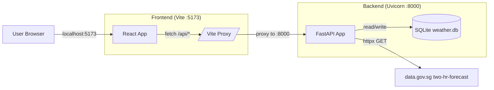
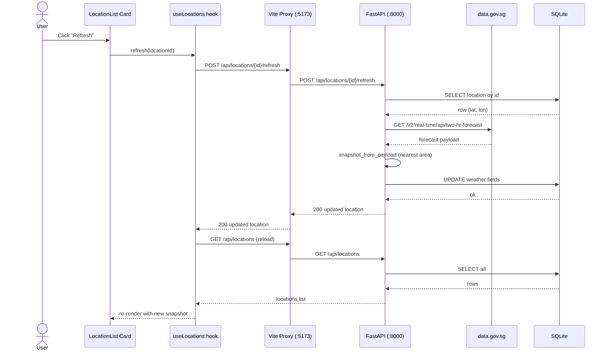

# Architecture

The app is intentionally small: a React SPA, a FastAPI service, a single SQLite file, and one external HTTP integration to `data.gov.sg`. Everything in this page is grounded in the source under `backend/app/` and `frontend/src/`.

## System overview



The browser only ever talks to the Vite dev server on port 5173. Anything under `/api` is transparently proxied to the FastAPI process on port 8000.

---

## The snapshot pattern

The `locations` table (created in `backend/app/main.py:17-35`) is a single denormalised table — there is no separate weather history table.

```sql
CREATE TABLE IF NOT EXISTS locations (
    id INTEGER PRIMARY KEY AUTOINCREMENT,
    latitude REAL NOT NULL,
    longitude REAL NOT NULL,
    created_at TEXT NOT NULL,
    weather_condition TEXT,
    weather_observed_at TEXT,
    weather_source TEXT,
    weather_area TEXT,
    weather_valid_period_text TEXT,
    weather_refreshed_at TEXT,
    UNIQUE(latitude, longitude)
)
```

Each location row carries **one snapshot** of the latest forecast. Refresh overwrites the `weather_*` columns in place — there is no time-series. Trade-offs:

- **Cheap reads.** `GET /api/locations` is a pure SQLite scan; no external network call sits in the page-load path.
- **Deterministic.** A page reload never produces fresh upstream traffic. The user explicitly opts into a network call by clicking *Refresh* on a card.
- **Lossy.** Older snapshots are discarded. If history is ever needed, this needs a separate table keyed on location id + timestamp.
- **Unique by coordinate.** `UNIQUE(latitude, longitude)` means duplicate adds are rejected (`POST /api/locations` returns 409).

A freshly created row uses `weather_condition = 'Not refreshed'` and `weather_source = 'not-refreshed'` as placeholder values, so the UI always has something to render before the first refresh.

---

## Frontend ↔ backend proxy

`frontend/vite.config.js`:

```javascript
const backendPort = env.VITE_BACKEND_PORT || '8000';
const apiTarget = env.VITE_API_TARGET || `http://localhost:${backendPort}`;

server: {
  port: 5173,
  proxy: {
    '/api': { target: apiTarget, changeOrigin: true },
  },
}
```

The React code (`frontend/src/api/client.js`) calls `fetch('/api/...')` with no host. The browser hits the Vite dev server on `http://localhost:5173`; Vite forwards anything under `/api` to the backend on `http://localhost:8000` (overridable with `VITE_BACKEND_PORT` or the full `VITE_API_TARGET`). Because the browser only ever sees one origin, no CORS configuration is needed in development.

In production this proxy does not exist — a real deployment would either serve the built React assets from FastAPI's static directory or front both with a reverse proxy.

---

## External API integration

`SingaporeWeatherClient` (`backend/app/services/weather_api.py`) wraps the data.gov.sg 2-hour forecast endpoint.

- **URL:** `https://api-open.data.gov.sg/v2/real-time/api/two-hr-forecast`
- **Client:** synchronous `httpx.Client` with an 8-second timeout and `User-Agent: weather-starter/0.1 (educational project)`.
- **Auth:** if the `WEATHER_API_KEY` environment variable is set, it is sent as the `x-api-key` header. The endpoint also works without a key.
- **Mapping:** `snapshot_from_payload` reads `data.area_metadata` (a list of named locations with their lat/lon) and `data.items[0].forecasts` (the per-area forecasts). It picks the area whose `label_location` is geographically closest to the requested coordinate and returns `{condition, observed_at, source, area, valid_period_text}`.
- **Errors:** every non-2xx, parse failure, or network error is re-raised as `WeatherProviderError` with a human-friendly message. The router maps that into a `502 Bad Gateway` (`backend/app/routers/locations.py:189`).

---

## Refresh sequence

What happens when a user clicks *Refresh* on a location card:



Step-by-step against the source:

1. `LocationList.jsx` calls `useLocations().refresh(location.id)` from the card's *Refresh* button onClick.
2. `useLocations.refresh` (`frontend/src/hooks/useLocations.jsx`) sets pending state, calls `apiRefreshLocation(id)`, then awaits `reload()` which re-fetches `GET /api/locations`.
3. `apiRefreshLocation` (`frontend/src/api/locations.js`) issues `POST /locations/{id}/refresh` via `request()` in `frontend/src/api/client.js`, which prefixes `/api` and uses a relative URL.
4. The Vite dev server proxies the request to the FastAPI process on port 8000.
5. `refresh_location` (`backend/app/routers/locations.py:151`) reads the row, instantiates `SingaporeWeatherClient`, calls `get_current_weather(lat, lon)` (one HTTP GET to data.gov.sg), then issues an `UPDATE` against the `locations` row with the new snapshot fields plus `weather_refreshed_at = now()`.
6. The handler returns the updated `row_to_dict(row)`. The hook then re-fetches the full list so every card stays in sync.

If the upstream call fails, the handler raises a `502` and the hook surfaces the error in the UI — the row is left untouched, so the previously stored snapshot is preserved.
